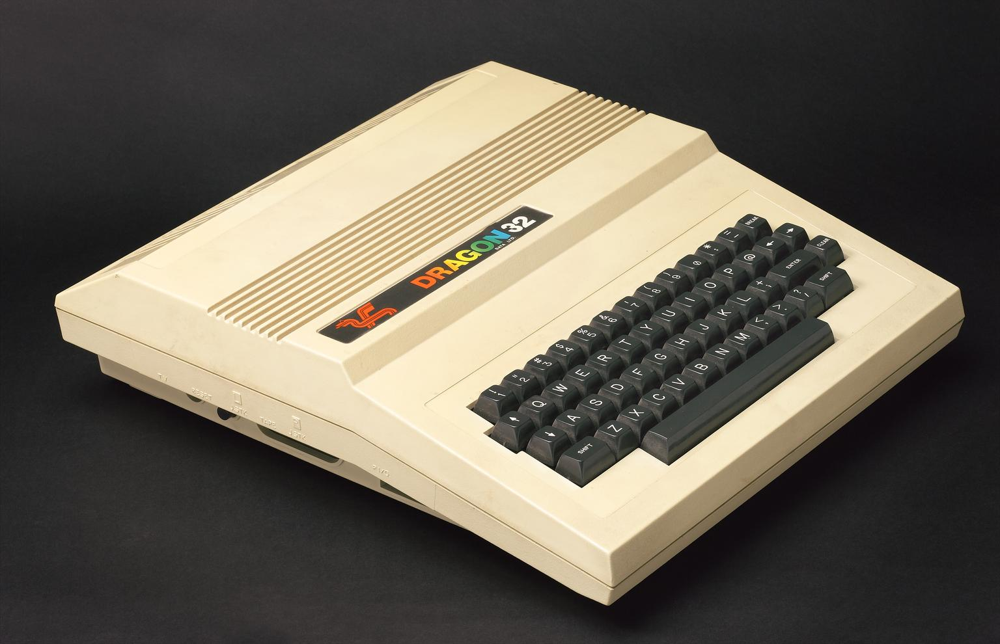

Hi Everybody,
I'm Mark, an ex clipper \ dbase \ visual basic \ Java developer who is nearing retirement.  
I first got interested in computing when I managed to get a place on the 1983\1984 computer studies 'O' level course at school.
At the same time my parents bought me a Dragon 32 home computer.  This was a great help with the programming side of things and it set me on way with a career as a computer programmer.  
In order to keep myself occupied in retirement I'm revisiting my Dragon 32 libraries and uploading them here.  I will also convert some of them to the TRS-80 \ CoCo computer.  Hopefully I'll be developing a few assembly \ machine code games in the future.  

